# Ontobi — Architecture

## System Overview

```mermaid
flowchart TB

    subgraph TOP_ROW[" "]
        direction LR

        subgraph VAULT["🗂 Obsidian Vault"]
            MD[".md files  ·  YAML frontmatter<br/>──────────────<br/>skos:prefLabel · skos:definition<br/>skos:broader · skos:narrower · skos:related<br/>schema:identifier · dateCreated · @type"]
        end

        subgraph ONTOBI_STACK[" "]
            direction TB

            subgraph ONTOBI_PLUGIN["@ontobi/obsidian  —  Obsidian Plugin (TypeScript · thin UI wrapper)"]
                direction LR
                OBS_BRIDGE["Vault Event Bridge<br/>──────────────<br/>vault.on('modify') → core.reindexFile()<br/>vault.on('delete') → core.removeFile()<br/>plugin settings · ribbon + command palette"]
                OBS_VIZ["Cytoscape.js · Graph View<br/>──────────────<br/>core.getNeighbourhood(id, depth)<br/>→ node/edge JSON → canvas<br/>CoSE force-directed layout"]
            end

            subgraph ONTOBI_CORE["@ontobi/core  —  Core Library (TypeScript · standalone · no Obsidian deps)"]
                direction LR
                CLI["CLI Entry Point<br/>──────────────<br/>ontobi serve · ontobi index<br/>chokidar watcher → reindexFile()<br/>SIGINT → graceful shutdown"]
                API["OntobiCore class<br/>──────────────<br/>start() · stop()<br/>indexVault() · reindexFile() · removeFile()<br/>query(sparql) · getNeighbourhood()"]
                PARSER["Frontmatter Parser<br/>──────────────<br/>gray-matter → YAML extraction<br/>custom prefix mapper (no jsonld dep)<br/>wikilink resolver · date normalizer"]
                OXI["Oxigraph · RDF Triplestore (WASM)<br/>──────────────<br/>in-process · in-memory<br/>SKOS + Schema.org in one graph<br/>SPARQL 1.1 · property paths<br/>per-file named graph → incremental invalidation<br/>N-Quads dump/restore for persistence"]
                HTTP["SPARQL Endpoint<br/>──────────────<br/>localhost:14321<br/>GET ?query= · POST body<br/>SELECT · ASK · CONSTRUCT"]
                CLI --> API
                API --> PARSER
                API --> OXI
                PARSER --> OXI
                OXI --> HTTP
            end

            ONTOBI_PLUGIN -- "npm dep · in-process" --> ONTOBI_CORE
        end
    end

    subgraph BOTTOM_ROW[" "]
        direction LR

        subgraph MCP_SERVER["@ontobi/mcp  —  MCP Server (TypeScript · separate process)"]
            direction LR
            SPARQL_CLIENT["SPARQL Client<br/>──────────────<br/>fetch → localhost:14321<br/>no local graph · on demand"]
            FILE_READER["File Reader<br/>──────────────<br/>fs.readFile(vaultPath + relPath)<br/>no Obsidian dependency"]
            TOOLS["MCP Tool Interface<br/>──────────────<br/>search_concepts → SPARQL<br/>expand_concept_graph → SPARQL<br/>get_concept_content → fs.readFile"]
            SPARQL_CLIENT --> TOOLS
            FILE_READER --> TOOLS
        end

        AGENT["LLM Agent<br/>──────────────<br/>search_concepts<br/>→ expand_concept_graph<br/>→ get_concept_content<br/>metadata-first · scoped context"]
    end

    MD -- "fs.readFile (CLI)" --> CLI
    MD -- "vault.read() (plugin)" --> OBS_BRIDGE
    MD -- "fs.readFile · on demand" --> FILE_READER
    OBS_BRIDGE -- "reindexFile(path)" --> API
    API -- "getNeighbourhood() → GraphData" --> OBS_VIZ
    HTTP -- "SPARQL · on demand" --> SPARQL_CLIENT
    TOOLS -- "MCP protocol" --> AGENT

    style AGENT         fill:#2d6a4f,color:#fff,stroke:#1b4332,stroke-width:2px
    style OXI           fill:#7b61ff,color:#fff,stroke:#5a3fd6,stroke-width:2px
    style HTTP          fill:#f4a261,color:#222,stroke:#e76f51,stroke-width:2px,stroke-dasharray:5 3
    style API           fill:#2d6a4f,color:#fff,stroke:#1b4332,stroke-width:2px
    style CLI           fill:#344e41,color:#fff,stroke:#1b4332,stroke-width:2px
    style OBS_VIZ       fill:#4a90d9,color:#fff,stroke:#2c6fad,stroke-width:2px
    style FILE_READER   fill:#adb5bd,color:#222,stroke:#6c757d,stroke-width:2px
    style ONTOBI_PLUGIN fill:#eef6ff,stroke:#4a90d9,stroke-width:2px,stroke-dasharray:4 3
    style ONTOBI_CORE   fill:#f8f4ff,stroke:#7b61ff,stroke-width:2px
    style MCP_SERVER    fill:#f0fff4,stroke:#2d6a4f,stroke-width:2px
    style TOP_ROW       fill:none,stroke:none
    style ONTOBI_STACK  fill:none,stroke:none
    style BOTTOM_ROW    fill:none,stroke:none
```



---

## Components

### `@ontobi/core` — Core Library

Standalone TypeScript library with zero Obsidian dependency. Runs headless via CLI or embedded inside the Obsidian plugin.

| Module | Responsibility |
|---|---|
| **Frontmatter Parser** | Reads `.md` files with `gray-matter`; maps `skos:*` and `schema:*` prefixes to full URIs via a custom prefix mapper; resolves `[[wikilinks]]` to concept identifiers; normalises date formats |
| **Triple Generator** | Converts `ConceptMetadata` to N-Quads using `n3`; assigns each concept to its own named graph (`file:///path/to/file.md`) for incremental invalidation |
| **Oxigraph Store** | In-memory Oxigraph WASM triplestore; SPARQL 1.1 including property paths; persistence via N-Quads dump/restore to `.ontobi/store.nq` |
| **SPARQL Endpoint** | Node.js `http` server on `localhost:14321`; accepts `GET ?query=` and `POST`; consumed by `@ontobi/mcp` |
| **OntobiCore** | Main API class — lifecycle, index management, and query interface |
| **CLI** | `ontobi serve --vault <path> [--index]` with chokidar file watching; `ontobi index` for one-shot rebuild |

### `@ontobi/mcp` — MCP Server

Separate process. Queries `@ontobi/core`'s SPARQL endpoint on demand. No local graph, no Obsidian dependency.

| Tool | Input | Action | Returns |
|---|---|---|---|
| `search_concepts` | `query: string, limit?: number` | SPARQL `REGEX` over labels + definitions | Concept list with metadata — no document bodies |
| `expand_concept_graph` | `concept_id: string, depth?: number` | SPARQL property path `(skos:broader\|skos:narrower\|skos:related){1,N}` | Neighbourhood graph (nodes + edges) — no document bodies |
| `get_concept_content` | `concept_id: string` | Named graph URI → `fs.readFile` | Full `.md` body |

Config via environment: `ONTOBI_SPARQL_ENDPOINT` (default `http://localhost:14321`), `ONTOBI_VAULT_PATH` (required).

### `@ontobi/obsidian` — Obsidian Plugin *(post-MVP)*

Thin UI wrapper. Imports `@ontobi/core` as an npm dependency (in-process). Adds no graph logic.

- **Vault event bridge** — `vault.on('modify' | 'delete' | 'rename')` → `core.reindexFile()` / `core.removeFile()`
- **Graph view** — `core.getNeighbourhood(id, depth)` → Cytoscape.js canvas inside an Obsidian leaf
- **Settings** — port, persistence path, index-on-load toggle

> The full pipeline (index → SPARQL → MCP → LLM agent) runs **headless via CLI alone**. The plugin is only required for the graph view inside Obsidian.

---

## Design Decisions

| Decision | Choice | Rejected | Rationale |
|---|---|---|---|
| **Graph standard** | RDF — triples + named graphs | LPG (Graphology, NetworkX) | SKOS and Schema.org are native RDF vocabularies; one graph, no schema mapping |
| **Triplestore** | Oxigraph WASM v0.5.5 (npm, in-process) | Graphology + NetworkX (Python) | Single store, SPARQL 1.1 property paths, runs in Electron without a separate service |
| **Query language** | SPARQL 1.1 property paths | Custom BFS/DFS | `(skos:narrower\|skos:related){1,3}` replaces all manual traversal; W3C standard |
| **Persistence** | Manual N-Quads dump/restore | RocksDB | Oxigraph npm/WASM build is in-memory only — disk persistence requires explicit `store.dump()` on shutdown and `store.load()` on startup |
| **Cross-process bridge** | localhost SPARQL HTTP | `graph.json` file export | No file I/O per query; MCP server fetches only the neighbourhood it needs |
| **MCP server language** | TypeScript | Python | Same runtime as `@ontobi/core`; no language boundary; shared `oxigraph` npm package |
| **Prefix expansion** | Custom mapper (~50 LOC) | `jsonld` npm package | Fixed vocabulary (SKOS + Schema.org only); avoids a dependency that pulls in an HTTP client |
| **Visualisation** | Cytoscape.js in `@ontobi/obsidian` | Cytoscape.js in `@ontobi/core` | Cytoscape.js requires a DOM; core must be headless-safe for CLI and CI |
| **File watching** | Caller-owned (CLI: chokidar · plugin: Obsidian events) | Built-in watcher in core | Avoids duplicate watchers in Obsidian; keeps core a pure stateless engine |
| **Content retrieval** | `fs.readFile(vaultPath + relPath)` in `@ontobi/mcp` | Obsidian `vault.read()` | `.md` files are plain files on disk; concept path is encoded in the named graph URI |

---

## Core API

```typescript
interface OntobiConfig {
  vaultPath: string         // absolute path to vault root
  sparqlPort?: number       // default: 14321
  persistencePath?: string  // default: <vaultPath>/.ontobi/store.nq
}

interface GraphData {
  nodes: Array<{ id: string; label: string; identifier: string; filePath: string }>
  edges: Array<{ source: string; target: string; relation: 'broader' | 'narrower' | 'related' }>
}

class OntobiCore {
  constructor(config: OntobiConfig)

  start(): Promise<void>                       // init store + SPARQL endpoint; restore N-Quads if present
  stop(): Promise<void>                        // stop endpoint + dump store to disk

  indexVault(): Promise<void>                  // glob *.md → parse → load (caller triggers; not auto on start)
  reindexFile(path: string): Promise<void>     // clear named graph → reparse → reload
  removeFile(path: string): Promise<void>      // drop named graph for deleted file

  query(sparql: string): Promise<SparqlResult>
  getNeighbourhood(conceptId: string, depth?: number): Promise<GraphData>
}
```
