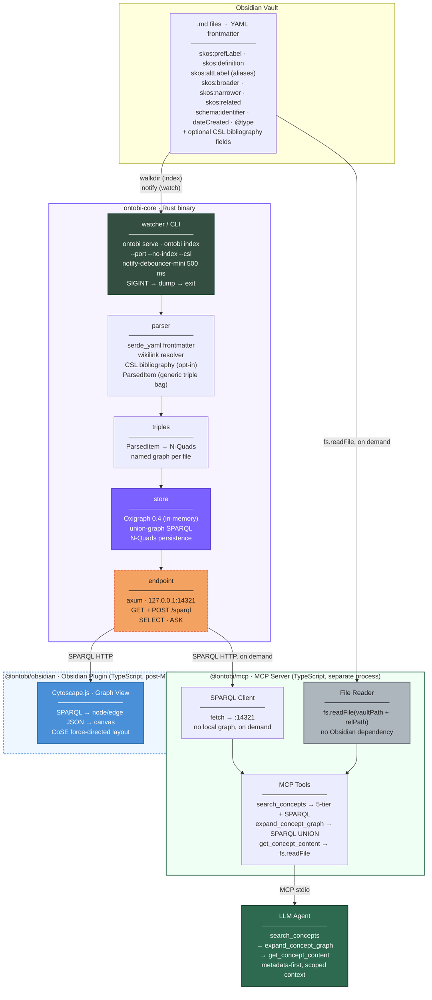

# Ontobi: Architecture

## System Overview



---

## Components

### `ontobi-core`: Core Binary (Rust)

Standalone Rust binary. No Node.js or Obsidian dependency.

| Module | Responsibility |
| --- | --- |
| **parser** (`parser/frontmatter.rs`, `parser/wikilink.rs`, `parser/csl.rs`) | `serde_yaml` frontmatter extraction. Wikilink resolver. Optional CSL/Zotero bibliography branch (enabled via `ParserConfig::csl_enabled` from the `--csl` flag). Produces `ParsedItem`, a type-agnostic generic record that replaces the older `ConceptMetadata` struct. |
| **triples** (`triples/mod.rs`) | Converts `ParsedItem` to N-Quads. One named graph per file (`file:///<vault-relative>`) for incremental invalidation. Subject URIs use the scheme `urn:ontobi:item:<identifier>`. |
| **store** (`store/mod.rs`) | `OntobiStore` wrapping `oxigraph::store::Store` (in-memory, no RocksDB). Manual N-Quads persistence to `.ontobi/store.nq`. SPARQL runs with `set_default_graph_as_union()` so plain queries see every graph. |
| **endpoint** (`endpoint/mod.rs`) | axum HTTP server on `127.0.0.1:<port>`. `GET /sparql?query=` and `POST /sparql` with `Content-Type: application/sparql-query`. Returns `application/sparql-results+json`. |
| **watcher** (`watcher/mod.rs`) | `notify-debouncer-mini` recursive vault watcher, 500 ms debounce. Calls `store.reindex_file()` or `store.remove_file()` per change. |
| **CLI** (`main.rs`) | Two subcommands (`serve`, `index`). Graceful SIGINT shutdown with N-Quads persistence. |

### `@ontobi/mcp`: MCP Server

Separate Node.js process. Queries `ontobi-core`'s SPARQL endpoint on demand. No local graph, no Obsidian dependency.

| Tool | Input | Action | Returns |
| --- | --- | --- | --- |
| `search_concepts` | `query: string`, `limit?: number` (1 to 50, default 10) | Five-tier fallback engine (see below). One pooled SPARQL query for candidates, one batched query for SKOS relations of the selected hits. Ranking happens in JS. | `Array<{ identifier, label, definition, file_path, aliases[], broader[], narrower[], related[] }>`. No document bodies. |
| `expand_concept_graph` | `concept_id: string`, `depth?: number` (1 to 5, default 1) | SPARQL UNION of explicit 1..depth hop chains over `skos:broader \| skos:narrower \| skos:related`. Oxigraph does not support `{n,m}` property-path repetition, so chains are expanded explicitly. | `{ center, depth, nodes: [{ id, label, definition, aliases[], file_path }], edges: [{ source, target, relation }] }`. |
| `get_concept_content` | `concept_id: string` | Resolves the named graph URI via SPARQL, then reads the `.md` body with `fs.readFile`. | `{ identifier, label, file_path, content }`. |

Config via environment:

| Var | Default | Purpose |
| --- | --- | --- |
| `ONTOBI_SPARQL_ENDPOINT` | `http://localhost:14321` | Where the Rust core listens. |
| `ONTOBI_VAULT_PATH` | (required) | Absolute path to the vault root for `fs.readFile`. |

#### Five-tier search (inside `search_concepts`)

The tool runs a staged matcher over a candidate pool. Tiers 1 and 2 always contribute. Tiers 3 to 5 are early-exit: the first non-empty tier wins. A concept matching multiple tiers keeps its lowest (best) tier number.

| # | Name | Semantics |
| --- | --- | --- |
| 1 | EXACT_LABEL | Case-insensitive equality with `skos:prefLabel`. |
| 2 | EXACT_ALIAS | Case-insensitive equality with any `skos:altLabel`. Useful for acronyms. |
| 3 | PHRASE_SUBSTRING | Full query is a substring of a label, alias, or definition. |
| 4 | TOKEN_MATCH | >=1 query token hit as a whole word. Heavy label weighting, all-tokens bonus, hub-node damping (1 / (1 + 0.1 * linkCount)) so high-degree concepts do not bridge-match on generic tokens. |
| 4b | TOKEN_DEF_ONLY | Hits only in the definition. Reduced weight, capped. Fills in when Tier 4 is sparse. |
| 5 | FUZZY_TRIGRAM | Trigram Jaccard over labels and aliases. Fires only if Tiers 3 and 4 are empty. |

The engine replaced a plain SPARQL `REGEX` implementation that had a 60% zero-hit rate on multi-word benchmark queries.

### `@ontobi/obsidian`: Obsidian Plugin (post-MVP)

Thin UI wrapper. Communicates with `ontobi-core` via HTTP. No direct import of the Rust binary.

- **Vault event bridge.** `vault.on('modify' | 'delete' | 'rename')` is forwarded to `ontobi-core` via HTTP.
- **Graph view.** SPARQL query to `localhost:14321`, rendered on a Cytoscape.js canvas inside an Obsidian leaf.
- **Settings.** Port, persistence path, index-on-load toggle.

> The full pipeline (index, SPARQL, MCP, LLM agent) runs **headless via CLI alone**. The plugin is only required for the graph view inside Obsidian.

---

## Design Decisions

| Decision | Choice | Rejected | Rationale |
| --- | --- | --- | --- |
| **Graph standard** | RDF (triples + named graphs) | LPG (Graphology, NetworkX) | SKOS and Schema.org are native RDF vocabularies. One graph, no schema mapping. |
| **Core implementation** | Rust native binary (`ontobi-core`) | TypeScript + Oxigraph WASM | Eliminates WASM overhead. Native Oxigraph crate has full API parity. No `dlltool`/MSVC on Windows when built with `default-features = false` (no RocksDB). |
| **Triplestore** | Oxigraph 0.4 crate (native Rust, in-memory) | Oxigraph WASM npm, RocksDB | Single crate. SPARQL 1.1 property paths. Avoids Electron WASM compilation quirks. |
| **Query language** | SPARQL 1.1 with `set_default_graph_as_union()` | Custom BFS/DFS | All data lives in named graphs (one per file). Union-default-graph makes plain `SELECT` queries transparent to callers. |
| **Persistence** | Manual N-Quads dump and restore | RocksDB | `default-features = false` disables RocksDB. N-Quads round-trip is sufficient for vault sizes. |
| **Parser surface** | Generic `ParsedItem` (predicate bag) | `ConceptMetadata` (one field per SKOS property) | Lets the triple generator stay fixed when new vocabularies (CSL, Schema.org extensions) are added. Enabled single-flag CSL/Zotero support. |
| **Cross-process bridge** | localhost SPARQL HTTP (identical wire format) | `graph.json` file export | `@ontobi/mcp`'s `SparqlClient` requires zero changes. Endpoint POST body is a raw SPARQL string. |
| **MCP server language** | TypeScript (unchanged) | Rust | `@ontobi/mcp` stays TypeScript. Rust core is a separate process connected via HTTP, not an in-process dependency. |
| **Search engine** | 5-tier JS matcher over a pooled candidate fetch | SPARQL `REGEX` in the tool | `REGEX` failed on multi-word queries (60% zero-hit rate in benchmarks). The tiered matcher is more robust and fast enough for vaults in the low thousands of concepts. |
| **Prefix expansion** | Custom `serde_yaml` deserialization + URI constants | `jsonld` crate | Fixed vocabulary (SKOS + Schema.org + optional CSL). About 50 LOC. Avoids a heavy dependency. |
| **Visualisation** | Cytoscape.js in `@ontobi/obsidian` | Cytoscape.js in core | Core must be headless-safe (no DOM). |
| **File watching** | `notify-debouncer-mini` inside the Rust binary | `chokidar` (Node.js) | Rust-native. No Node.js process required alongside the binary. |
| **Content retrieval** | `fs.readFile(vaultPath + relPath)` in `@ontobi/mcp` | Obsidian `vault.read()` | `.md` files are plain files. Concept path is encoded in the named graph URI. |

---

## CLI Reference (`ontobi-core`)

```
# Start SPARQL endpoint and index the vault (default behaviour)
ontobi serve --vault <path> [--port 14321] [--csl]

# Fast restart: skip indexing, restore from persisted store.nq
ontobi serve --vault <path> --no-index

# --vault can be omitted if ONTOBI_VAULT_PATH is set in the environment
ONTOBI_VAULT_PATH=<path> ontobi serve

# One-shot index and exit (for CI / cache rebuild)
ontobi index --vault <path> [--csl]
```

Flags:

| Flag | Subcommand | Default | Purpose |
| --- | --- | --- | --- |
| `--vault <path>` | `serve`, `index` | (falls back to `ONTOBI_VAULT_PATH`) | Vault root. |
| `--port <n>` | `serve` | `14321` | TCP port for the SPARQL endpoint. |
| `--no-index` | `serve` | off | Skip indexing on startup. Load from `.ontobi/store.nq` instead. |
| `--csl` | `serve`, `index` | off | Enable CSL/Zotero bibliography indexing alongside SKOS. Files with a `citation-key` field are treated as bibliography entries and enriched with Schema.org triples. |

The endpoint listens on `127.0.0.1:<port>` and accepts:

```
GET  /sparql?query=<url-encoded-SPARQL>
POST /sparql                              # body: raw SPARQL string
                                          # Content-Type: application/sparql-query
                                          # → application/sparql-results+json
```

## Store API (Rust, `OntobiStore`)

```rust
pub struct OntobiStore { /* Arc-backed, Clone = shared handle */ }

impl OntobiStore {
    pub fn new() -> Result<Self>
    pub fn with_config(config: ParserConfig) -> Result<Self>
    pub fn load_from_file(&self, path: &Path) -> Result<()>
    pub fn dump_to_file(&self, path: &Path) -> Result<()>
    pub fn reindex_file(&self, vault_path: &Path, file_path: &Path) -> Result<()>
    pub fn remove_file(&self, vault_path: &Path, file_path: &Path) -> Result<()>
    pub fn index_vault(&self, vault_path: &Path) -> Result<usize>
    pub fn query_json(&self, sparql: &str) -> Result<Vec<u8>>   // SPARQL JSON bytes
    pub fn query_bool(&self, sparql: &str) -> Result<bool>      // ASK queries
}
```
