# Ontobi — Architecture

## System Overview

```mermaid
flowchart TB

    subgraph TOP_ROW[" "]
        direction LR

        subgraph VAULT["🗂 Obsidian Vault"]
            MD[".md files  ·  YAML frontmatter<br/>──────────────<br/>skos:prefLabel · skos:definition<br/>skos:broader · skos:narrower · skos:related<br/>schema:identifier · dateCreated · @type"]
        end

        subgraph ONTOBI_STACK[" "]
            direction TB

            subgraph ONTOBI_PLUGIN["@ontobi/obsidian  —  Obsidian Plugin (TypeScript · thin UI wrapper)"]
                direction LR
                OBS_BRIDGE["Vault Event Bridge<br/>──────────────<br/>vault.on('modify') → core.reindexFile()<br/>vault.on('delete') → core.removeFile()<br/>plugin settings · ribbon + command palette"]
                OBS_VIZ["Cytoscape.js · Graph View<br/>──────────────<br/>core.getNeighbourhood(id, depth)<br/>→ node/edge JSON → canvas<br/>CoSE force-directed layout"]
            end

            subgraph ONTOBI_CORE["@ontobi/core  —  Core Library (TypeScript · standalone · no Obsidian deps)"]
                direction LR
                CLI["CLI Entry Point<br/>──────────────<br/>ontobi serve · ontobi index<br/>chokidar watcher → reindexFile()<br/>SIGINT → graceful shutdown"]
                API["OntobiCore class<br/>──────────────<br/>start() · stop()<br/>indexVault() · reindexFile() · removeFile()<br/>query(sparql) · getNeighbourhood()"]
                PARSER["Frontmatter Parser<br/>──────────────<br/>gray-matter → YAML extraction<br/>custom prefix mapper (no jsonld dep)<br/>wikilink resolver · date normalizer"]
                OXI["Oxigraph · RDF Triplestore (WASM)<br/>──────────────<br/>in-process · in-memory<br/>SKOS + Schema.org in one graph<br/>SPARQL 1.1 · property paths<br/>per-file named graph → incremental invalidation<br/>N-Quads dump/restore for persistence"]
                HTTP["SPARQL Endpoint<br/>──────────────<br/>localhost:14321<br/>GET ?query= · POST body<br/>SELECT · ASK · CONSTRUCT"]
                CLI --> API
                API --> PARSER
                API --> OXI
                PARSER --> OXI
                OXI --> HTTP
            end

            ONTOBI_PLUGIN -- "npm dep · in-process" --> ONTOBI_CORE
        end
    end

    subgraph BOTTOM_ROW[" "]
        direction LR

        subgraph MCP_SERVER["@ontobi/mcp  —  MCP Server (TypeScript · separate process)"]
            direction LR
            SPARQL_CLIENT["SPARQL Client<br/>──────────────<br/>fetch → localhost:14321<br/>no local graph · on demand"]
            FILE_READER["File Reader<br/>──────────────<br/>fs.readFile(vaultPath + relPath)<br/>no Obsidian dependency"]
            TOOLS["MCP Tool Interface<br/>──────────────<br/>search_concepts → SPARQL<br/>expand_concept_graph → SPARQL<br/>get_concept_content → fs.readFile"]
            SPARQL_CLIENT --> TOOLS
            FILE_READER --> TOOLS
        end

        AGENT["LLM Agent<br/>──────────────<br/>search_concepts<br/>→ expand_concept_graph<br/>→ get_concept_content<br/>metadata-first · scoped context"]
    end

    MD -- "fs.readFile (CLI)" --> CLI
    MD -- "vault.read() (plugin)" --> OBS_BRIDGE
    MD -- "fs.readFile · on demand" --> FILE_READER
    OBS_BRIDGE -- "reindexFile(path)" --> API
    API -- "getNeighbourhood() → GraphData" --> OBS_VIZ
    HTTP -- "SPARQL · on demand" --> SPARQL_CLIENT
    TOOLS -- "MCP protocol" --> AGENT

    style AGENT         fill:#2d6a4f,color:#fff,stroke:#1b4332,stroke-width:2px
    style OXI           fill:#7b61ff,color:#fff,stroke:#5a3fd6,stroke-width:2px
    style HTTP          fill:#f4a261,color:#222,stroke:#e76f51,stroke-width:2px,stroke-dasharray:5 3
    style API           fill:#2d6a4f,color:#fff,stroke:#1b4332,stroke-width:2px
    style CLI           fill:#344e41,color:#fff,stroke:#1b4332,stroke-width:2px
    style OBS_VIZ       fill:#4a90d9,color:#fff,stroke:#2c6fad,stroke-width:2px
    style FILE_READER   fill:#adb5bd,color:#222,stroke:#6c757d,stroke-width:2px
    style ONTOBI_PLUGIN fill:#eef6ff,stroke:#4a90d9,stroke-width:2px,stroke-dasharray:4 3
    style ONTOBI_CORE   fill:#f8f4ff,stroke:#7b61ff,stroke-width:2px
    style MCP_SERVER    fill:#f0fff4,stroke:#2d6a4f,stroke-width:2px
    style TOP_ROW       fill:none,stroke:none
    style ONTOBI_STACK  fill:none,stroke:none
    style BOTTOM_ROW    fill:none,stroke:none
```



---

## Components

### `ontobi-core` — Core Binary (Rust)

Standalone Rust binary. No Node.js or Obsidian dependency.

| Module | Responsibility |
|---|---|
| **parser** (`parser/wikilink.rs`, `parser/frontmatter.rs`) | `serde_yaml` frontmatter extraction; wikilink resolver; date normaliser; produces `ConceptMetadata` |
| **triples** (`triples/mod.rs`) | Converts `ConceptMetadata` to N-Quads strings; places each concept in its own named graph (`file:///...`) for incremental invalidation |
| **store** (`store/mod.rs`) | `OntobiStore` wrapping `oxigraph::store::Store` (in-memory, no RocksDB); N-Quads persistence to `.ontobi/store.nq`; union-graph SPARQL |
| **endpoint** (`endpoint/mod.rs`) | axum HTTP server on `localhost:14321`; `GET /sparql?query=` and `POST /sparql`; returns `application/sparql-results+json` |
| **watcher** (`watcher/mod.rs`) | `notify-debouncer-mini` recursive vault watcher; debounced 500 ms; calls `store.reindex_file()` / `store.remove_file()` |
| **CLI** (`main.rs`) | `ontobi serve --vault <path> [--index]` and `ontobi index`; graceful SIGINT shutdown with N-Quads persistence |

### `@ontobi/mcp` — MCP Server

Separate process. Queries `ontobi-core`'s SPARQL endpoint on demand. No local graph, no Obsidian dependency.

| Tool | Input | Action | Returns |
|---|---|---|---|
| `search_concepts` | `query: string, limit?: number` | SPARQL `REGEX` over labels + definitions | Concept list with metadata — no document bodies |
| `expand_concept_graph` | `concept_id: string, depth?: number` | SPARQL property path `(skos:broader\|skos:narrower\|skos:related){1,N}` | Neighbourhood graph (nodes + edges) — no document bodies |
| `get_concept_content` | `concept_id: string` | Named graph URI → `fs.readFile` | Full `.md` body |

Config via environment: `ONTOBI_SPARQL_ENDPOINT` (default `http://localhost:14321`), `ONTOBI_VAULT_PATH` (required).

### `@ontobi/obsidian` — Obsidian Plugin *(post-MVP)*

Thin UI wrapper. Communicates with `ontobi-core` via HTTP. No direct import of the Rust binary.

- **Vault event bridge** — `vault.on('modify' | 'delete' | 'rename')` → HTTP to `ontobi-core`
- **Graph view** — SPARQL query to `localhost:14321` → Cytoscape.js canvas inside an Obsidian leaf
- **Settings** — port, persistence path, index-on-load toggle

> The full pipeline (index → SPARQL → MCP → LLM agent) runs **headless via CLI alone**. The plugin is only required for the graph view inside Obsidian.

---

## Design Decisions

| Decision | Choice | Rejected | Rationale |
|---|---|---|---|
| **Graph standard** | RDF — triples + named graphs | LPG (Graphology, NetworkX) | SKOS and Schema.org are native RDF vocabularies; one graph, no schema mapping |
| **Core implementation** | Rust native binary (`ontobi-core`) | TypeScript + Oxigraph WASM | Eliminates WASM overhead; native Oxigraph crate has full API parity; no `dlltool`/MSVC on Windows required when using `default-features = false` (no RocksDB) |
| **Triplestore** | Oxigraph 0.4 crate (native Rust, in-memory) | Oxigraph WASM npm, RocksDB | Single crate; SPARQL 1.1 property paths; avoids Electron WASM compilation quirks |
| **Query language** | SPARQL 1.1 with `set_default_graph_as_union()` | Custom BFS/DFS | All data lives in named graphs (one per file); union-default-graph mode makes plain `SELECT` queries transparent to callers |
| **Persistence** | Manual N-Quads dump/restore | RocksDB | `default-features = false` disables RocksDB; N-Quads round-trip is sufficient for vault sizes |
| **Cross-process bridge** | localhost SPARQL HTTP (identical wire format) | `graph.json` file export | `@ontobi/mcp`'s `SparqlClient` requires zero changes; endpoint POST body = raw SPARQL string |
| **MCP server language** | TypeScript (unchanged) | Rust | `@ontobi/mcp` stays TypeScript; Rust core is a separate process connected via HTTP, not an in-process dependency |
| **Prefix expansion** | Custom `serde_yaml` deserialization + URI constants | `jsonld` crate | Fixed vocabulary (SKOS + Schema.org); ~50 LOC; avoids a heavy dependency |
| **Visualisation** | Cytoscape.js in `@ontobi/obsidian` | Cytoscape.js in core | Core must be headless-safe (no DOM) |
| **File watching** | `notify-debouncer-mini` inside the Rust binary | `chokidar` (Node.js) | Rust-native; no Node.js process required alongside the binary |
| **Content retrieval** | `fs.readFile(vaultPath + relPath)` in `@ontobi/mcp` | Obsidian `vault.read()` | `.md` files are plain files; concept path encoded in named graph URI |

---

## CLI Reference (`ontobi-core`)

```
# Start SPARQL endpoint, optionally index vault first
ontobi serve --vault <path> [--port 14321] [--index]

# One-shot index and exit (for CI / cache rebuild)
ontobi index --vault <path>
```

The endpoint listens on `127.0.0.1:<port>` and accepts:

```
GET  /sparql?query=<url-encoded-SPARQL>
POST /sparql                              # body: raw SPARQL string
                                          # Content-Type: application/sparql-query
                                          # → application/sparql-results+json
```

## Store API (Rust, `OntobiStore`)

```rust
pub struct OntobiStore { /* Arc-backed, Clone = shared handle */ }

impl OntobiStore {
    pub fn new() -> Result<Self>
    pub fn load_from_file(&self, path: &Path) -> Result<()>
    pub fn dump_to_file(&self, path: &Path) -> Result<()>
    pub fn reindex_file(&self, vault_path: &Path, file_path: &Path) -> Result<()>
    pub fn remove_file(&self, vault_path: &Path, file_path: &Path) -> Result<()>
    pub fn index_vault(&self, vault_path: &Path) -> Result<usize>
    pub fn query_json(&self, sparql: &str) -> Result<Vec<u8>>   // SPARQL JSON bytes
    pub fn query_bool(&self, sparql: &str) -> Result<bool>      // ASK queries
}
```
